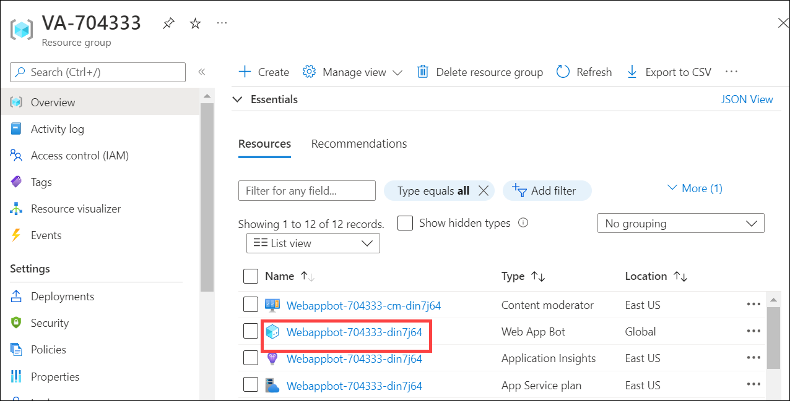
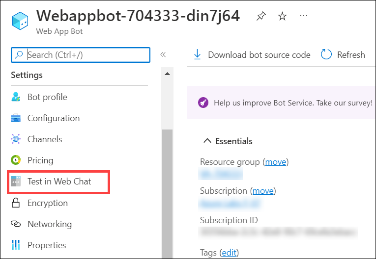
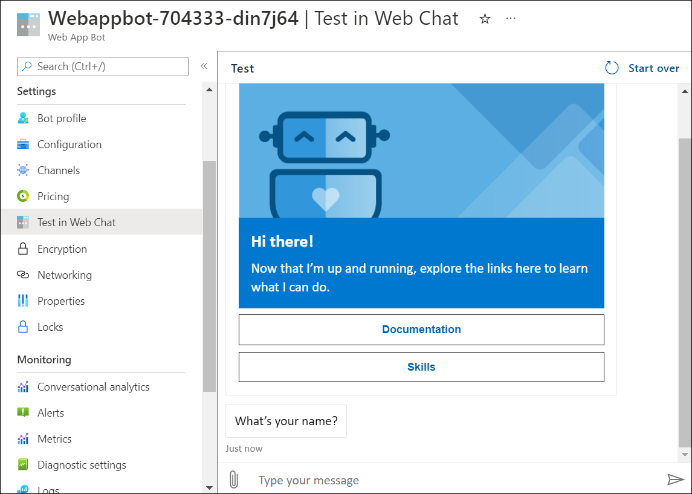
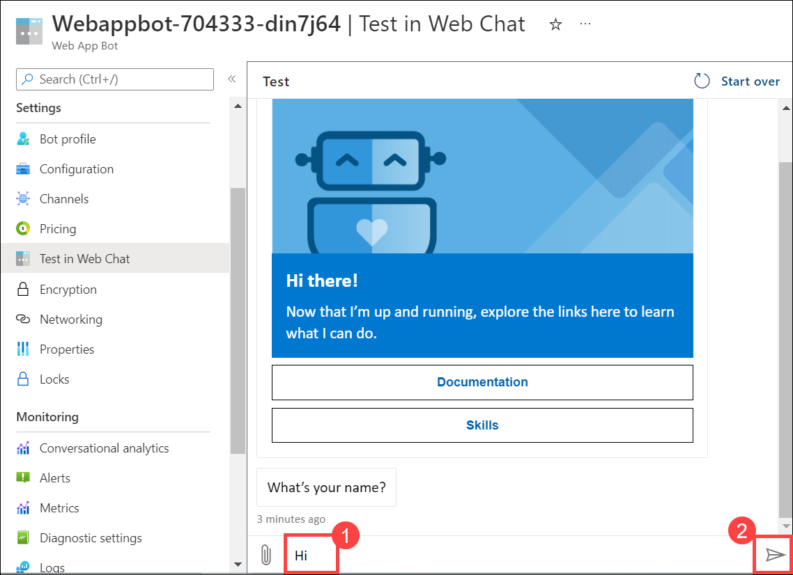
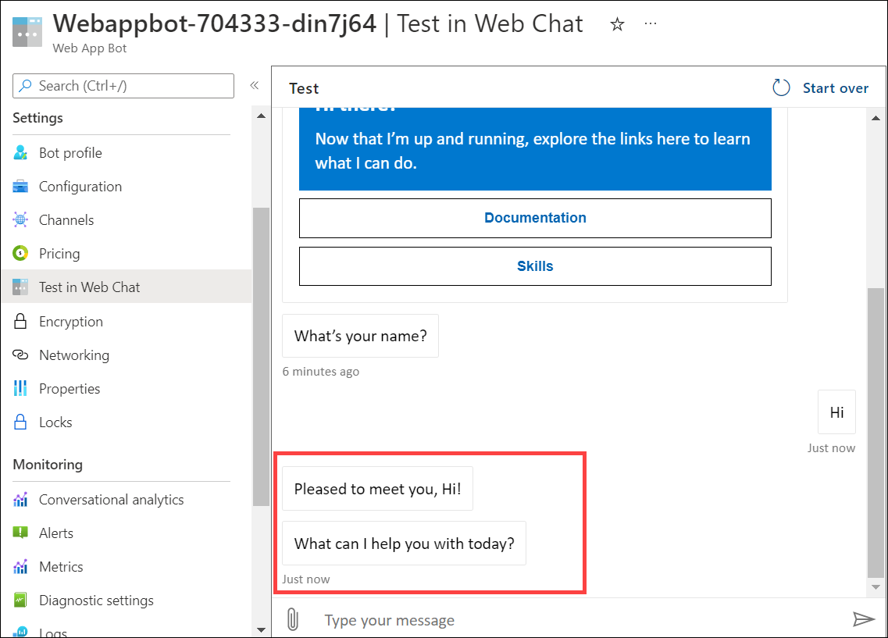

# Virtual Assistant Deployer

This solution accelerator provides a way to deploy a Microsoft Virtual Assistant Solution) without needing to install all the prerequisite tools on your own machine. It uses a preconfigured docker container to create and deploy the virtual assistant with minimal effort and time.

Once completed, you will have a Virtual Assistant deployed into Azure as well as the code available to make modifications and deploy updates.

You can find more references about Microsoft Virtual Assistant Solution here: `https://microsoft.github.io/botframework-solutions/overview/virtual-assistant-solution/`

## Deploying your Virtual Assistant
There are two options to quickly getting your Virtual Assistant up and running.
1. Deploy with Visual Studio Codespaces - This is the simplest and will all happen online. The only thing you need is an Azure Subscription.

    - You can find more references about deploying with Visual Studio Codespaces here: `https://github.com/tejaswini972/Virtual-Assistant-Deployer/blob/master/docs/visualstudioonline.md`

2. Deploy with Visual Studio Code locally - This option uses your locally installed VS Code and Docker to do the work.

   - You can find more references about deploying with Visual Studio Code locally here: `https://github.com/tejaswini972/Virtual-Assistant-Deployer/blob/master/docs/visualstudiocode.md`

## Getting Started

1. In the lab setup we have automated the below steps:

   - **Virtual Assistant Deployment**: Virtual Assistant has been set up using a Docker container and deployed it into Azure.

   - **Resource Deployment**:  The deployment of Web App Bot, App Service and its related resources, Application Insights, Azure Cosmos DB account, Content moderator, Language understanding service, QnA maker, Search service and Storage account has been automated.

- In order to complete the solution accelerator perform the below steps:

## Test the deployed Virtual Assistant

In this task, you will talk to your deployed Virtual Assistant in Azure.

1. Navigate to the browser tab in which Azure Portal is open. If you have closed the tab, navigate to the URL `https://portal.azure.com` to open the Azure portal.

1. Navigate to **VA-<inject key="DeploymentID" />** resource group and select the **Web App Bot** resource named **Webappbot-UniqueId**.

   
   
1. Select the **Test in Web Chat** under settings from the left hand side menu.

   
   
1. Now, you will be presented with a message from bot saying it is up and running.

   
   
1. Next, type **Hi** in the **Enter message** box and click on **Send** button.

   
   
1.  You can review the bot's response.

    
   
1. You can go ahead and enter the below queries then review the bot's behaviour.

   - How old are you?
   - Who built you?
   - How do you work?
   - Can you ask anything about me?
   - What is your boss' name?
   - Can you draw something?
   
   
