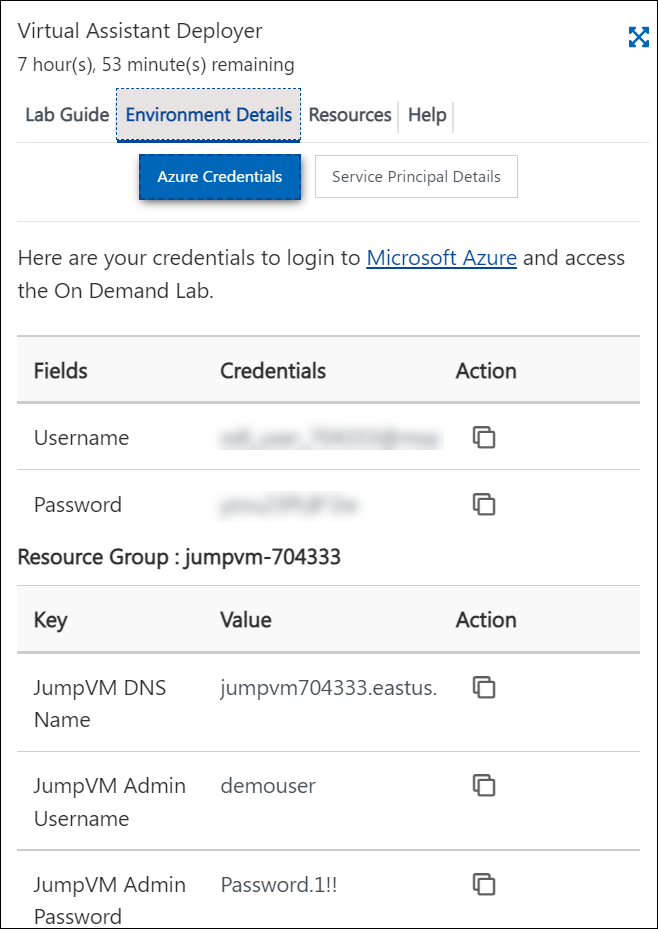
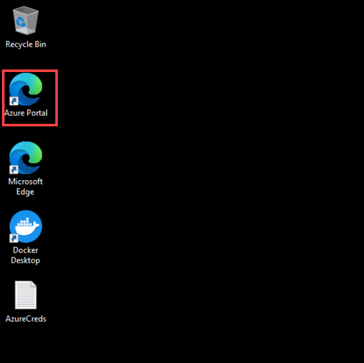
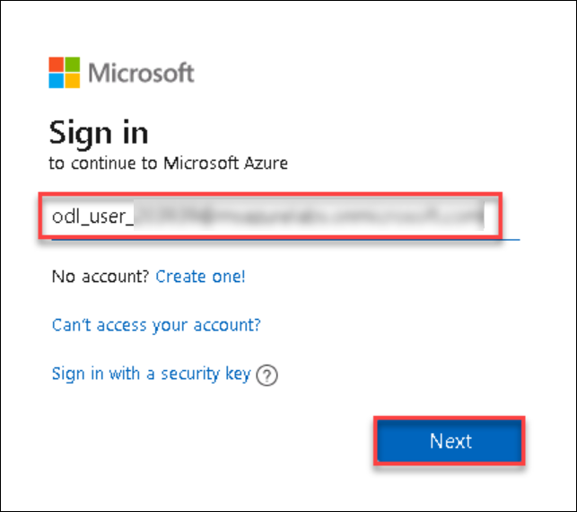
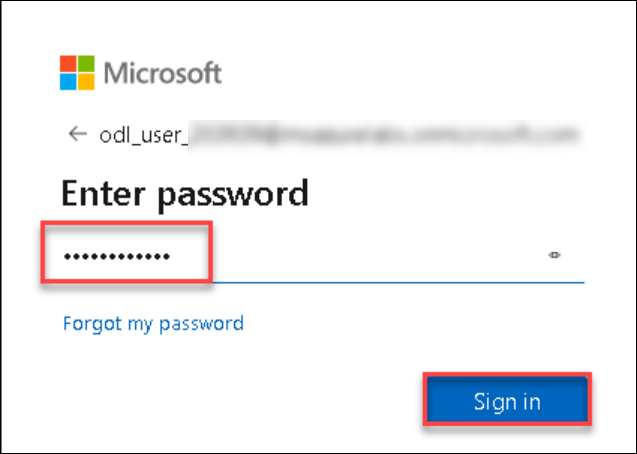
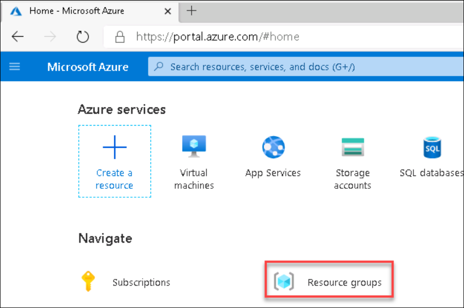
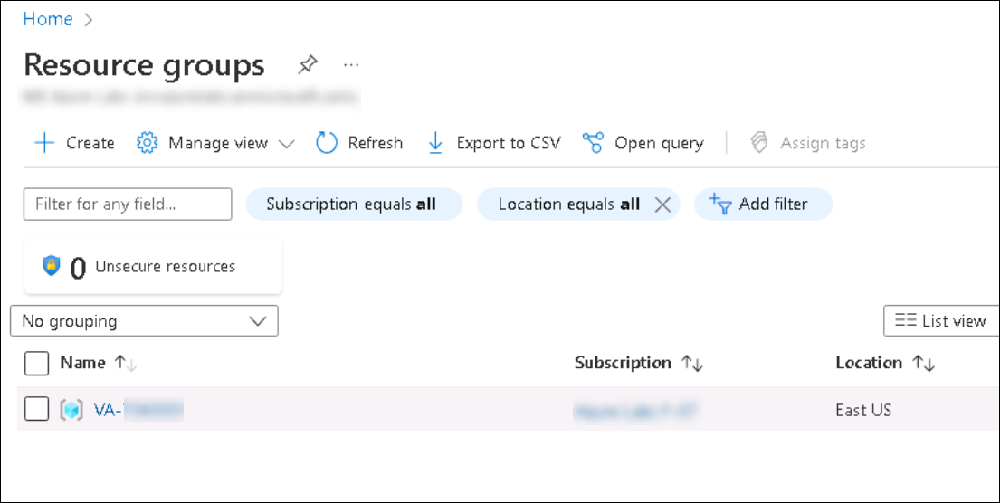
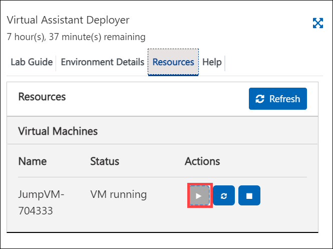

# Getting Started with Lab

1. Once the environment is provisioned, a virtual machine (JumpVM) and lab guide will get loaded in your browser. Use this virtual machine throughout the workshop to perform the the lab.

   
   
1. To get the lab environment details, you can select **Environment Details** tab. Additionally, the credentials will also be sent to your email address provided during registration. 

   
 
## Login to Azure Portal

1. In the JumpVM, click on Azure portal shortcut of Microsoft Edge browser which is created on desktop.

   
   
1. When you click on Azure portal shortcut, you will be presented with a **Sign in** balde to sign-in to Azure.
   
1. On **Sign in to Micsoft Azure** tab you will see login screen, in that enter following email/username and then click on **Next**. 
   * Email/Username: <inject key="AzureAdUserEmail"></inject>
   
     
     
1. Now enter the following password and click on **Sign in**.
   * Password: <inject key="AzureAdUserPassword"></inject>
   
     
     
1. If you see the pop-up **Stay Signed in?**, click No

1. If you see the pop-up **You have free Azure Advisor recommendations!**, close the window to continue the lab.

1. If a **Welcome to Microsoft Azure** popup window appears, click **Maybe Later** to skip the tour.
   
1. Now you will see Azure Portal Dashboard, click on **Resource groups** to see the resource groups.

   
   
1. Confirm you have the resource group named **VA-<inject key="DeploymentID" enableCopy="false" />** are present as shown below.

   
   
1. Now, click on the **Resource group** 

## Resource Start/Stop

If your environment is stopped due to inactivity feature, please follow the below steps to start the resources: 

1. Select the **Resources** tab and click on **Start** button to start the resources.

